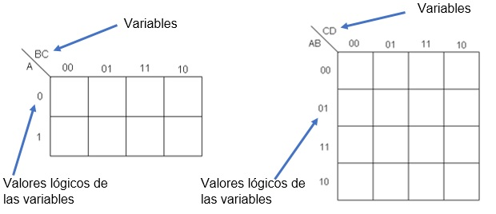
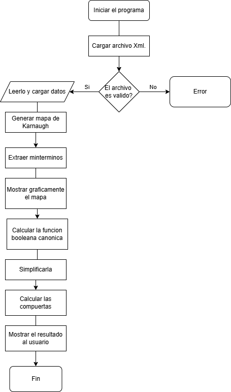
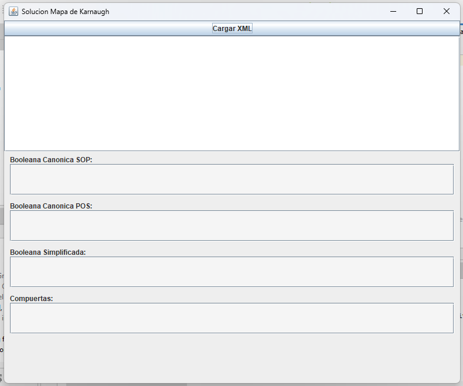
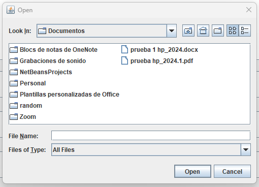
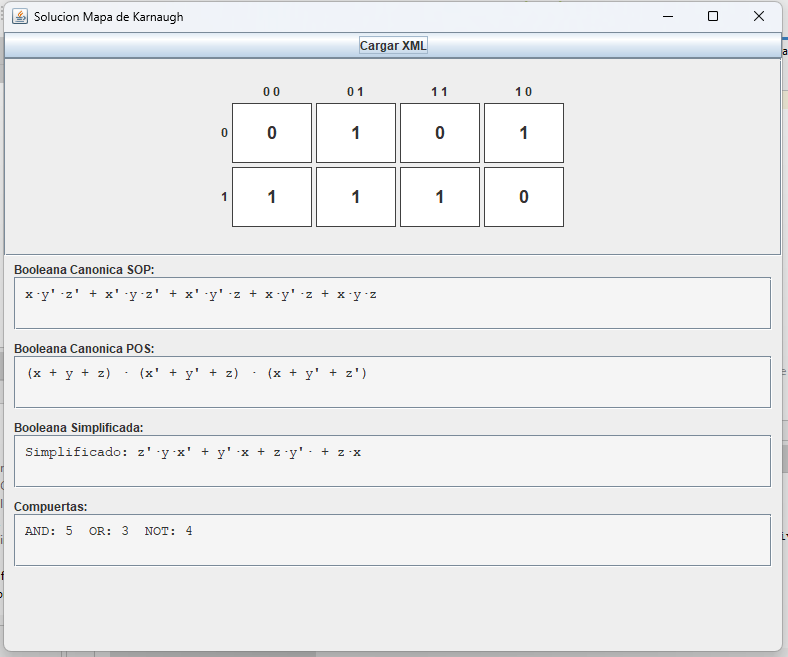

# Proyecto: Programa de Análisis de Mapas de Karnaugh

**Universidad de San Carlos de Guatemala**

**Curso:** Matematica para computacion 

**Sección:** C  

**Catedrático:** Carlos Angulo 

**Auxiliar:** Brayan Prado 


*Programa para la Lectura y Resolución de Mapas de Karnaugh*


**Integrantes:**  
- Nombre: Sergio Vinicio Samayoa Escobar 
- Carne: 202403974

- Nombre: Marco André Perez Villagrán
- Carne: 202400662
  
**Grupo 4**

**Fecha:** 18 de Abril del 2025  


---

## Índice

1. Introducción  
2. Objetivos  
3. Marco Teórico  
4. Descripción del Problema  
5. Propuesta Lograda  
6. Algoritmo  
7. Diagrama de Flujo  
8. Pseudocódigo  
9. Implementación del Algoritmo a Nivel de Código  
10. Mockups del Software  
11. Conclusiones  
12. Referencias  

---

## Introducción

Este proyecto se se realiza con el fin de llegar a analizar y comprender de mejor manera el tema de "Mapa de Karnaugh" entendiendo asi todo lo que con lleva realizarlo y a su vez lo que significa obtener una respuesta como tal, de esta forma se hace un mejor entendimiento general del tema y se aplican conocimientos nuevos aprendiendo a utilizar demas herramientas como Lenguajes de programacion, no solo para ejecutarlo si no tambien para documentarlo, haciendonos una idea de como es la elaboracion de un proyecto profesional en este tipo de ambito.

---

## Objetivos

**Objetivo General:**  

El objetivo General de este proyecto es crear un programa que ayude a la simplificacion de funciones booleanas a su forma canonica de manera visual, extrayendo la informacion de un archivo.

**Objetivos Específicos:**  
- 1: Extraer y leer la informacion del archivo   
- 2: Crear una interfaz grafica que enseñe el Mapa de Karnaugh 
- 3: Simplificar la funcion 
- 4: Mostrar la funcion booleana canonica, simplificada y la cantidad de compuertas logicas 
- 5: trabajar en parejas para la elaboracion del proyecto
---

## Marco Teórico


Los mapas de Karnaugh son una herramienta utilizada para la simplificación de funciones lógicas booleanas y a diferencia de la resolución por algebra de Boole,  este es un método gráfico que implica conocer las representaciones canónicas  de las funciones.

El Mapa de Karnaugh tiene la característica de que puede ser visto como una representación bidimensional de una tabla de verdad. En la tabla de verdad, se colocan las variables por columnas y las combinaciones de tales variables determinan un valor de salida, 0 o 1, sin embargo, en el mapa las variables se colocan como si de un plano cartesiano se tratara, respetando cada una de las combinaciones que de ellas se generan, y colocando en la intersección de las combinaciones de las variables, el valor de salida.

Una de las ventajas de estos elementos gráficos, es que evitan la realización de cálculos algebraicos, y al determinar la función de salida, esta se encuentre minimizada.

Los mapas muestran la relación que existe entre  las entradas y las salidas de un circuito lógico, si se aplica adecuadamente el resultado será el más simplificado posible. Pueden ser utilizados para cualquier número de variables de entrada sin embargo se recomienda un máximo de seis variables.



---

## Descripción del Problema

Se debe de diseñar un software el cual pueda y tenga la capacidad de poder leer un archivo xml el cual contendrá las instrucciones para la realización de un mapa de Karnaugh y encontrar su función booleana canónica, simplificada y la cantidad de compuertas lógicas que deberá de utilizar si se necesitara realizar un circuito electrónico funcional.

---

## Propuesta Lograda

Despues de varios tutoriales, videos y demas ayuda se llego a estandarizar un modelo que cumpla con los requerimiento mediante una idea previa, la cual elaboramos con un analisis del problema del cual extrajimos y formamos una diagrama de flujo, de ahi sale todo lo demas que es: el algortimo, el Pseudocodigo y a su vez el codigo. Se propuso hacer principalmente primero el detector de archivos y posteriormente la parte visual, asignando asi botones y funciones para que funcione todo. 

---

## Algoritmo

1. Iniciar el programa.
2. Solicitar al usuario que seleccione un archivo `.xml`.
3. Leer el número de variables y los minitérminos desde el archivo.
4. Crear una estructura que represente el mapa de Karnaugh.
5. Llenar el mapa con los valores correspondientes.
6. Mostrar visualmente el mapa al usuario en una interfaz gráfica.
7. Calcular la función booleana canónica (Suma de Productos).
8. Simplificar la función booleana usando agrupación de minitérminos.
9. Contar el número de compuertas lógicas necesarias.
10. Mostrar al usuario:
    - Mapa de Karnaugh.
    - Función canónica.
    - Función simplificada.
    - Número de compuertas lógicas.
11. Finalizar programa.


---


## Diagrama de Flujo




---

## Pseudocódigo

```
INICIO
   
    archivo ← solicitarArchivoXML()

    SI archivo es válido ENTONCES

        datos ← leerXML(archivo)
        mapa ← generarMapaKarnaugh(datos)
        mostrarMapa(mapa)

        funcionCanonica ← obtenerFuncionCanonica(mapa)
        funcionSimplificada ← simplificarFuncion(funcionCanonica)
        cantidadCompuertas ← contarCompuertas(funcionSimplificada)

        mostrarResultados(funcionCanonica, funcionSimplificada, cantidadCompuertas)

    SINO

        mostrarError("Archivo inválido o mal formado")
    FIN SI
FIN

```
---

## Implementación del Algoritmo a Nivel de Código 

Para lograr implementar el algoritmo a nivel de codigo se siguieron diferentes pruebas, a base de videos, recursos, tutorias y prueba y error se llego a desarollar el codigo.

---

## Mockups del software 







---


## Conclusiones  

Al implementar un software que genera funciones booleanas y las simplifica mediante mapas de Karnaugh, se puede automatizar un proceso que puede volverse complejo y propenso a errores si se realiza manualmente.

El uso de archivos XML como entrada proporciona flexibilidad y escalabilidad, lo que le permite cambiar o agregar datos sin cambiar el código fuente.

Al separar clases y responsabilidades dentro del programa, se facilita su mantenimiento, ampliación y comprensión.

La visualización de funciones canónicas y simplificadas y el conteo de puertas lógicas brindan al usuario una visión general clara del comportamiento lógico de un sistema digital.

El proyecto profundiza en los conceptos de álgebra booleana, estructuras de control, diseño modular en Java y los fundamentos de la electrónica digital.


---


## Referencias  


[youtube.com/Uso de markdown](https://youtu.be/oxaH9CFpeEE?si=RSFwVhP6vQjTNDAn)

[youtube.com/Uso de Java](https://youtu.be/U709qY6S9rA?si=ydIuo7h9XfqJFI1f)

[Mapa de Karnaugh](https://virtual.cuautitlan.unam.mx/intar/sistdig/mapas-de-karnaugh/)
